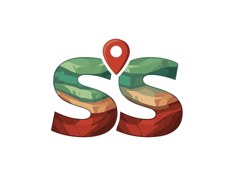

# 🚀 Pompilius - StrataShare Backend

<div align="center">



**Robust and scalable backend for the StrataShare platform**

**Backend version: `v1.0.0`**

[](https://www.scala-lang.org/)
[](https://www.playframework.com/)
[](https://www.mysql.com/)
[](https://www.docker.com/)

</div>

---

## 📋 Table of Contents

- [Description](#-description)
- [Features](#-features)
- [Architecture](#️-architecture)
- [Technologies](#-technologies)
- [Prerequisites](#-prerequisites)
- [Installation](#-installation)
- [Configuration](#️-configuration)
- [Usage](#-usage)
- [Project Structure](#-project-structure)
- [API Endpoints](#-api-endpoints)
- [Database](#️-database)
- [Docker](#-docker)
- [Testing](#-testing)

---

## 📖 Description

**Pompilius** is the backend of the **StrataShare** platform, an application designed to facilitate the exchange and trading of geological resources between users. Built with Scala and Play Framework, it offers a robust and scalable RESTful API with authentication, user management, transactions, Stripe payments, and much more.

### ✨ What does StrataShare do?

StrataShare allows users to:
- 👤 Manage their profile and authentication
- 📚 Share and sell geological resources
- 🔄 Perform barter exchanges between users
- 💳 Process secure payments through Stripe
- 💎 Leave reviews and ratings
- 🏆 Earn achievement badges
- 🌍 Multi-language support (English and Spanish)

## 🎯 Features

### 🔐 Authentication and Security
- Robust session system with HTTP-only cookies
- Role-based authentication (user and administrator)
- Password recovery via email
- Rate limiting to prevent abuse
- Email validation (disposable email blocker)
- Configurable maximum login attempts

### 💼 Resource Management
- Complete CRUD for geological resources
- Resource samples management
- Study resources management
- File attachments and avatars system
- HTML sanitization for security

### 💰 Transactions and Payments
- Stripe payment flow implemented
- Stripe webhooks for payment confirmation
- Transaction processing and management
- Barter system between users
- Platform commission management (5%)
- Multi-currency support (EUR by default)
- Automated worker for expired transaction cleanup

### ⭐ Social System
- User/resource reviews and ratings
- Badge system and gamification
- Country and context management

### 📧 Communication and Events
- Email sending with template support
- Event tracking and processing
- SMTP configuration for different providers ((tested with Gmail))

### 🌐 API and Documentation
- Fully documented RESTful API
- Swagger UI integration
- Complete OpenAPI specifications
- Configurable CORS support

### 📊 Observability and Background Tasks
- Complete logging with Logback
- SQL performance metrics (ScalikeJDBC)
- Configurable slow query detection
- Scheduled background workers for maintenance tasks

---

### 🧭 Implemented but pending full rollout 

The following capabilities are already present in the codebase and data model, but are still in progressive rollout or pending full product integration:

- **User statistics module (`userStatistics`)**: base domain/repository pieces exist for usage metrics and profile-level insights.
- **Reports module (`report`)**: report entities, repository and export-related flows are implemented, with staged activation for admin reporting.
- **Barter email management flows**: email and queue infrastructure exists for barter lifecycle notifications, with pending coverage for all functional scenarios/templates.
- **Advanced admin capabilities**: admin routes and role-based controls are available, with additional management features planned for future releases.
- **Background and operational capabilities**: scheduled workers, event tracking, and maintenance flows are implemented and continue evolving for stronger observability/automation.

---

## 🏗️ Architecture

The project follows a **hexagonal architecture (ports and adapters)** with **Domain-Driven Design (DDD)** principles:

```
app/dev/pompilius/
├── auth/               # Authentication module
│   ├── domain/         # Business logic and entities
│   ├── application/    # Use cases
│   └── infrastructure/ # Repositories, controllers, writers, etc.
├── users/              # User management
├── resource/           # Geological resources
├── sample/             # Resource samples
├── study/              # Study resources
├── payment/            # Payment system
├── transaction/        # Transaction management
├── barter/             # Exchange system
├── review/             # Reviews and ratings
├── badge/              # Badges and achievements
├── attachment/         # File attachments
├── mail/               # Email services
├── event/              # Event system
├── gateways/           # Payment gateways
├── country/            # Country management
├── context/            # Application contexts
├── worker/             # Background workers (scheduled tasks)
├── swagger/            # API documentation
└── shared/             # Shared utilities
```

### Layers:
- **Domain**: Entities, value objects, business rules
- **Application**: Use cases, application services
- **Infrastructure**: Concrete implementations (DB, HTTP, etc.)

---

## 🛠️ Technologies

### Backend Core
- **[Scala 2.13.16](https://www.scala-lang.org/)** - Functional programming language
- **[Play Framework 3.0.8](https://www.playframework.com/)** - Reactive web framework
- **[Apache Pekko](https://pekko.apache.org/)** - Asynchronous task scheduling and streaming

### Database
- **[MySQL 8.0](https://www.mysql.com/)** - Relational database
- **[ScalikeJDBC 4.3.4](http://scalikejdbc.org/)** - SQL-Based ORM
- **[HikariCP](https://github.com/brettwooldridge/HikariCP)** - High-performance connection pool
- **[Play Evolutions](https://www.playframework.com/documentation/latest/Evolutions)** - Database migrations

### External Services
- **[Stripe Java SDK 29.3.0](https://stripe.com/)** - Payment processing
- **[Apache Commons Email](https://commons.apache.org/proper/commons-email/)** - Email sending

### Utilities
- **[Enumeratum](https://github.com/lloydmeta/enumeratum)** - Type-safe enumerations
- **[Jsoup 1.21.1](https://jsoup.org/)** - HTML sanitization and security
- **[Apache Commons Codec](https://commons.apache.org/proper/commons-codec/)** - Encoding/Decoding
- **[Apache Commons Text](https://commons.apache.org/proper/commons-text/)** - String manipulation

### Documentation
- **[Play Swagger 2.0.4](https://github.com/iheartradio/play-swagger)** - Swagger generation
- **[Swagger UI 5.26.2](https://swagger.io/tools/swagger-ui/)** - Visual API interface

### Testing
- **[ScalaTest](http://www.scalatest.org/)** - Testing framework
- **[Mockito](https://site.mockito.org/)** - Mocking framework
- **[ScalikeJDBC Test](http://scalikejdbc.org/)** - Database testing

### DevOps
- **[Docker](https://www.docker.com/)** - Containerization
- **[Docker Compose](https://docs.docker.com/compose/)** - Container orchestration
- **[SBT](https://www.scala-sbt.org/)** - Build tool

### Code Quality
- **[Scapegoat](https://github.com/sksamuel/sbt-scapegoat)** - Static code analysis
- Strict Scala compiler configurations

---

## 📦 Prerequisites

Before you begin, make sure you have installed:

- **[Java JDK 21+](https://adoptium.net/)** - Eclipse Temurin OpenJDK recommended
- **[SBT 1.12.11+](https://www.scala-sbt.org/download.html)** - Scala Build Tool
- **[MySQL 8.0+](https://dev.mysql.com/downloads/mysql/)** - Database
- **[Docker](https://www.docker.com/get-started)** (Optional) - For deployment
- **[Git](https://git-scm.com/)** - Version control

### Recommended
- **[IntelliJ IDEA](https://www.jetbrains.com/idea/)** with Scala plugin
- Use the integrated **Swagger UI** for API testing (available at `/swagger/swagger-ui/index.html`)

---

## 🚀 Installation

### 1. Clone the Repository

```bash
git clone https://github.com/yourusername/StrataShare-Backend.git
cd StrataShare-Backend/Pompilius
```

### 2. Configure MySQL Database

```sql
CREATE DATABASE pompilius CHARACTER SET utf8mb4 COLLATE utf8mb4_unicode_ci;
CREATE USER 'upompilius'@'localhost' IDENTIFIED BY 'test1234';
GRANT ALL PRIVILEGES ON pompilius.* TO 'upompilius'@'localhost';
FLUSH PRIVILEGES;
```

### 3. Install Dependencies

```bash
sbt update
```

### 4. Run Migrations

Migrations run automatically when starting the application thanks to Play Evolutions. If you prefer to run them manually:

```bash
sbt "runMain dev.pompilius.shared.infrastructure.MigrationsRunner"
```

---

## ⚙️ Configuration

### Main Configuration File

The project uses different configuration files depending on the environment:

- **`conf/application.conf`** - Base configuration
- **`conf/application-dev.conf`** - Development
- **`conf/application-pro.conf`** - Production

### Important Environment Variables

```bash
# Database
JDBC_DATABASE_URL=jdbc:mysql://localhost:3306/pompilius?useUnicode=true&useSSL=false&serverTimezone=UTC
JDBC_DATABASE_USERNAME=upompilius
JDBC_DATABASE_PASSWORD=test1234

# Stripe (Payments)
STRIPE_SECRET_KEY=sk_test_...
STRIPE_PUBLISHABLE_KEY=pk_test_...
STRIPE_WEBHOOK_SECRET=whsec_...

# Payment URLs (Success/Cancel redirects)
PAYMENT_COMPLETED_URL=http://localhost:5500/pages/transactions/payment-success.html?sellerId=${sellerId}&resourceId=${resourceId}
PAYMENT_CANCELED_URL=http://localhost:5500/pages/transactions/payment-cancel.html?sellerId=${sellerId}&resourceId=${resourceId}

# Barter URLs
PURCHASE_RESOURCE_URL=https://stratashare.dev/barter

# Email (SMTP)
MAIL_HOST=smtp.gmail.com
MAIL_USERNAME=your-email@gmail.com
MAIL_PASSWORD=your-app-password
```

### Stripe Configuration

To use the payment system, you need to configure your Stripe keys in `conf/application.conf`:

```hocon
stripe {
    sandbox = true
    secretKey = "sk_test_your_secret_key"
    publishableKey = "pk_test_your_public_key"
    webhookSecret = "whsec_your_webhook_secret"
    currency = "EUR"
}
```

### CORS Configuration

For local development with frontend, adjust the allowed origins:

```hocon
play.filters.cors {
  allowedOrigins = ["http://localhost:5500", "http://127.0.0.1:5500"]
  allowedHttpMethods = ["GET", "POST", "PUT", "DELETE", "OPTIONS"]
  supportsCredentials = true
}
```

---

## 💻 Usage

### Run in Development Mode

```bash
sbt run
```

The application will be available at: **http://localhost:9000**

### Watch Mode (Auto-reload)

```bash
sbt ~run
```

### Compile for Production

```bash
sbt clean compile stage
```

### Run Tests

```bash
# All tests
sbt test

# Specific tests
sbt "testOnly *SessionRepositorySpec"

# With coverage
sbt clean coverage test coverageReport
```

### Code Analysis (Scapegoat)

```bash
sbt scapegoat
```

Reports are generated in: `target/scala-2.13/scapegoat-report/`

---

## 📁 Project Structure

```
Pompilius/
│
├── app/                              # Main source code
│   ├── Module.scala                  # Dependency injection configuration
│   └── dev/pompilius/
│       ├── auth/                     # Authentication and sessions
│       │   ├── domain/              # Entities: Session, User, etc.
│       │   ├── application/         # Use cases
│       │   └── infrastructure/      # MySQL Repositories, Controllers
│       ├── users/                    # User management
│       ├── resource/                 # Geological resources
│       ├── sample/                   # Resource samples
│       ├── study/                    # Study resources
│       ├── payment/                  # Stripe payment system
│       ├── transaction/              # Transaction management
│       ├── barter/                   # Exchange system
│       ├── review/                   # Reviews and ratings
│       ├── badge/                    # Badge system
│       ├── attachment/               # File attachments management
│       ├── mail/                     # Email services
│       ├── event/                    # Event system
│       ├── gateways/                 # Payment gateways
│       ├── country/                  # Country management
│       ├── context/                  # Contexts and configurations
│       ├── worker/                   # Background workers (scheduled tasks)
│       ├── swagger/                  # API documentation generation
│       └── shared/                   # Shared code
│           ├── domain/              # Value objects, Clock, etc.
│           └── infrastructure/      # Utilities, filters, error handlers
│
├── conf/                             # Configuration files
│   ├── application.conf             # Main config
│   ├── routes                       # Main routes
│   ├── *.routes                     # Module routes
│   ├── logback.xml                  # Logging configuration
│   ├── messages.*                   # i18n (English/Spanish)
│   ├── swagger.yml                  # OpenAPI specification
│   └── evolutions/default/          # SQL migrations (37 files)
│
├── test/                             # Unit and integration tests
│   └── resource/
│
├── project/                          # SBT configuration
│   ├── build.properties             # SBT version
│   ├── plugins.sbt                  # SBT plugins
│   └── ScapegoatCommon.scala        # Scapegoat config
│
├── public/                           # Static resources
│   └── images/
│
├── target/                           # Compiled files
│
├── build.sbt                         # Project definition
├── Dockerfile                        # Docker image
├── compose.yaml                      # Docker Compose
└── README.md                         # This file

```

### Main Modules

| Module | Description                                                         |
|--------|---------------------------------------------------------------------|
| **auth** | Authentication system, sessions, login/logout, password reset       |
| **users** | User management, profiles, avatars, email validation                |
| **resource** | Geological resource CRUD operations                                  |
| **sample** | Resource sample management                                          |
| **study** | Study resource management                                           |
| **payment** | Stripe integration, checkout, webhooks                              |
| **transaction** | Transaction processing and management                               |
| **barter** | P2P exchange system between users                                   |
| **review** | Reviews, ratings, feedback                                          |
| **badge** | Badges, achievements, gamification                                  |
| **attachment** | File upload, storage, and retrieval                                 |
| **mail** | Email sending and template management                               |
| **event** | Event tracking and processing                                       |
| **gateways** | Payment gateway management                                          |
| **country** | Country and location management                                     |
| **context** | Application context and configuration                               |
| **worker** | Background workers for scheduled tasks (e.g., expired transactions) |
| **swagger** | API documentation generation                                        |
| **shared** | Utilities, pagination, error handling, filters                      |

---

## 🌐 API Endpoints

### 📝 Swagger Documentation

Once the application is started, access the interactive documentation:

**Swagger UI**: http://localhost:9000/swagger/swagger-ui/index.html

**JSON Spec**: http://localhost:9000/swagger/swagger.json

---

## 🗄️ Database

### Schema

The project uses **40 SQL migrations** (evolutions) to manage the database schema.

#### Main Tables

```sql
-- Users and authentication
users
sessions
users_roles

-- Educational resources
resources
samples
study
attachment
resource_attachments

-- Transactions
transaction
payment
payment_intent
barter


-- Social
review
badge
users_badge
users_followers

-- System
countries
context
request_log
```

### Migrations

Migrations are located in `conf/evolutions/default/` and are applied automatically in order:

- `1.sql` - User and authentication tables
- `2.sql` - Resource tables
- `3.sql` - Payment system
- ...
- `40.sql` - Latest migration

### Migration Management

```bash
# Apply pending migrations (automatic on startup)
# Configured in application.conf:
play.evolutions.autoApply = true

# Rollback 
play.evolutions.autoApplyDowns = false # Set to true to allow automatic rollbacks (use with caution)
```

---

## 🐳 Docker

### Build the Image

```bash
# Manual build
docker build -t pompilius:latest .

# With registry name
docker build -t ghcr.io/jai1234daw/pompilius:latest .
```

### Run with Docker Compose

The project includes a complete `compose.yaml` with three services:

- **mysql**: MySQL 8 database
- **backend**: Pompilius API
- **frontend**: Nautilus frontend (in separate container)

```bash
# Start all services
docker compose up -d

# View logs
docker compose logs -f backend

# Stop services
docker compose down

# Clean volumes (be careful!)
docker compose down -v
```

### Environment Variables in Docker

The `compose.yaml` includes the database connection variables. You may need to add additional environment variables for production:

```yaml
environment:
  # Database
  JDBC_DATABASE_URL: "jdbc:mysql://mysql:3306/pompilius?..."
  JDBC_DATABASE_USERNAME: pompilius
  JDBC_DATABASE_PASSWORD: pompilius
  
  # Payment URLs
  PAYMENT_COMPLETED_URL: "https://chimerical-arithmetic-26f21f.netlify.app/payment-success.html?sellerId=${sellerId}&resourceId=${resourceId}"
  PAYMENT_CANCELED_URL: "https://chimerical-arithmetic-26f21f.netlify.app/payment-cancel.html?sellerId=${sellerId}&resourceId=${resourceId}"
  
  # Stripe
  STRIPE_SECRET_KEY: "sk_live_..."
  STRIPE_WEBHOOK_SECRET: "whsec_..."
```

### Volumes

```yaml
volumes:
  pompilius-data:      # Attachment storage
  pompilius-db:        # MySQL data
```

---

## 🧪 Testing

- Unit testing with Mockito
- Async testing support
- Test-specific configuration support

### Test Structure

```
test/
├── dev/pompilius/
    ├── attachment/infrastructure/repositories/
    │   └── AttachmentMySqlRepositorySpec.scala    # Repository tests
    └── resource/application/
       └── ResourceServiceSpec.scala              # Service tests with Mockito
                            
```

### Available Test Suites

- **AttachmentMySqlRepositorySpec** - Repository behavior specifications
- **ResourceServiceSpec** - Service layer tests using Mockito mocks
- **SampleCrudUseCaseSpec** - Sample CRUD unit tests
- **StudyCrudUseCaseSpec** - Study CRUD unit tests
- **ResourceWriterUnitTest** - Resource JSON writer unit tests

### Run Tests

```bash
# All tests
sbt test

# Compile only test sources
sbt "test:compile"

# Specific test file
sbt "testOnly *ResourceServiceSpec"

```

### Report Bugs

Open an issue with:
- Detailed problem description
- Steps to reproduce
- Expected vs actual behavior
- Relevant logs

---

## 📧 Contact

**StrataShare Team**
- Email: sharestrata@gmail.com
- Website: https://chimerical-arithmetic-26f21f.netlify.app/index.html

---

## 🙏 Acknowledgments

- **[Play Framework](https://www.playframework.com/)** - Exceptional web framework
- **[ScalikeJDBC](http://scalikejdbc.org/)** - Simple and powerful ORM
- **[Stripe](https://stripe.com/)** - Payment platform
- **[Swagger](https://swagger.io/)** - API documentation

---

<div align="center">

**Built layer by layer 🪨 Like sedimentary strata, Pompilius was crafted with patience and precision**

---

**StrataShare Team** | *Connecting people through geological knowledge*

</div>

